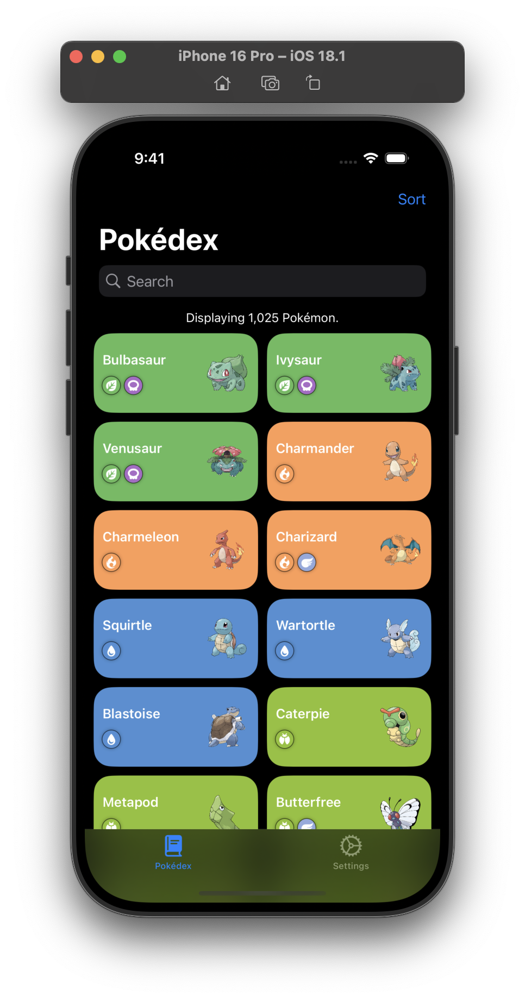

# SwiftUI-Pokedex
A Pokédex app created with the SwiftUI framework that utilizes data from [PokeAPI](https://pokeapi.co).

## Screenshots 📱

### Design Mockups 🎨

<div>
  
</div>

### Light Mode ☀️

<div>
  
  
  
</div>

### Dark Mode 🌙

<div>
  
  
  
</div>


## To-Do List 📝
### High Priority
- [ ] Design the Pokemon Detail View
- [ ] Fetch Pokemon detail information from API endpoint
### Medium Priority
- [ ] Add a filter option for the home view
- [ ] Add functionality to sort by option (Sort by ID, name, height, weight)
- [ ] Update settings view (i.e. to change display style, measurement system, etc.)
### Low Priority
- [ ] Add ability to favorite Pokemon and have them displayed first

## Explanations & Issues

The data provided for all Pokemon results only includes a `name` and `url` property. To have access to each Pokemon type, I just created a local JSON file *"pokemon.json"* that includes the following properties for all 905 Pokemon.

```json
[
  {
    "id": 1,
    "name": "bulbasaur",
    "types": ["grass", "poison"]
  }
]
```

The JSON is just decoded from the app bundle. I could use the GraphQL endpoint to grab specific data, but I don't think it's necessary for what I am trying to accomplish. An actual API call will be used, though, to gather further Pokemon data that is used in the detail view for each Pokemon.
